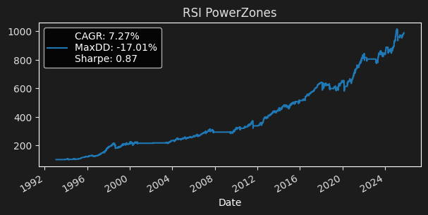

## Introduction

This repository contains a library of strategies that I have developed over the years. This README is a reference point for those that are interesting.

## Buy The Fear, Sell The Greed 

This is a notebook that implements the strategies described in the book "Buy The Fear, Sell The Greed" by Larry Connors.

Notebook : [Buy The Fear](https://github.com/chickenopoulos/strategy-library/blob/master/Buy%20The%20Fear.ipynb)

Source : https://www.amazon.in/Buy-Fear-Sell-Greed-Behavioral/dp/0578206501

## Trend Following by Carlo Zarattini

This notebook contains the Python implementation of the rules of the Trend Following strategy by Carlo Zarattini et al., along with a few extra personal ideas

Notebook : [Trend-Following by Carlo Zarattini](https://github.com/chickenopoulos/strategy-library/blob/master/Trend-Following%20by%20Carlo%20Zarattini.ipynb)

Source : https://papers.ssrn.com/sol3/papers.cfm?abstract_id=5084316

## Momentum RSI in Crypto by Pedma, Trading Research Hub (Substack)

Contains the implementation of the momentum RSI strategy proposed in the substack article and evaluates the signal strength and strategy performance.

Notebook : [Momentum RSI in Crypto](https://github.com/chickenopoulos/strategy-library/blob/master/Momentum%20RSI%20in%20Crypto%20-%20Trading%20Research%20Hub%2C%20Substack.ipynb)

Source : https://tradingresearchub.com/p/flipping-the-rsi-script-when-overbought?lli=1

## Simple Pairs Trading

As the title says, this is a simple pairs trading notebook. I load up the data, pick a high correlated pair, then trade the z-score of its spread long/short. Although simple, 
it appears to be high effective, thus I will work on the proposed next steps (see at the bottom of the notebook) when pairs trading comes up again as a theme in my backlog (soon).

Notebook : [Buy the Fear](https://github.com/chickenopoulos/strategy-library/blob/master/Buy%20The%20Fear.ipynb)

## Regime-based Breakout in Crypto

A simple breakout strategy using the donchian upper channels, with a twist - we only enter if the asset is having a favorable 14-day beta to the market (total crypto mcap). We measure
the market's ROC over the last 14 days, and we compare the ROC's sign with the asset's beta sign. If the are aligned (+/+ or -/-) then the token is moving towards a favorable direction.

Notebook : [Regime-based Breakout in Crypto](https://github.com/chickenopoulos/strategy-library/blob/master/Regime-based%20Breakout%20in%20Crypto.ipynb)